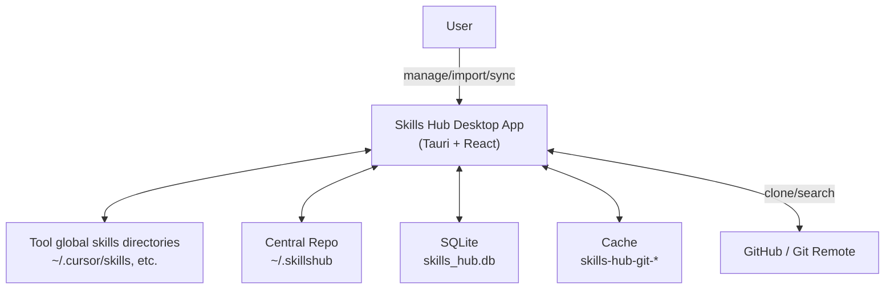
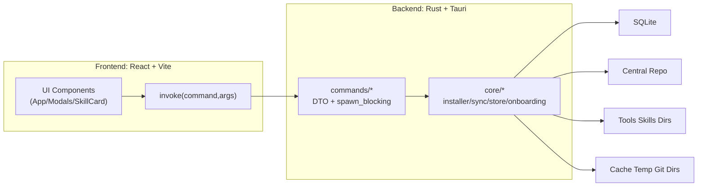
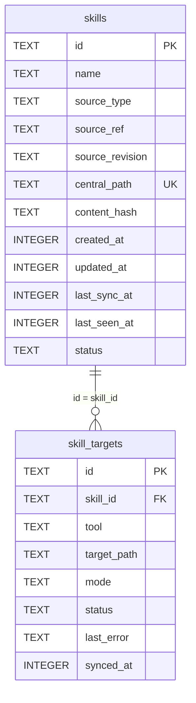

# Skills Hub (Tauri Desktop) — System Design

This document describes the system design of **Skills Hub**, aligned with the current repository implementation.

> 中文版：[`docs/system-design.zh.md`](docs/system-design.zh.md)

## 1. Background

AI coding tools (Cursor, Claude Code, Codex, etc.) often support “Skills/Agents/Tools”, but each tool stores global skills in a different location. This causes duplicated installs, drift, and a lack of a unified view.

Skills Hub solves this by storing skill contents in a **Central Repo** and mapping them into each tool via **symlink/junction/copy** — “Install once, sync everywhere”.

## 2. Goals

- Unified view of managed skills and per-tool activation
- Onboarding migration: scan existing skills in installed tools, group by name, detect conflicts via content hash, then import & sync
- Import sources: local folder and Git URLs (including multi-skill repo selection)
- Update: refresh central content from source; propagate updates to copy-mode targets
- Tool detection: detect newly installed tools and prompt to sync
- Configurable Central Repo path (default `~/.skillshub`)

## 3. Glossary

- **Skill**: a directory-based capability package (typically contains `SKILL.md`)
- **Managed Skill**: a skill stored in the Central Repo and indexed in SQLite
- **Central Repo**: canonical storage directory, default `~/.skillshub`
- **Tool/Agent**: a supported AI coding tool with a global skills directory
- **Target**: per-tool mapping of a managed skill (symlink/junction/copy), stored in `skill_targets`
- **Fingerprint / Content Hash**: directory hash used to detect identical vs conflicting variants

## 4. Architecture

### 4.1 System Context

### 4.2 Containers

## 5. Storage Design

### 5.1 Filesystem

- Central Repo (default): `~/.skillshub`
- Git imports: clone into cache temp, then copy into Central Repo (Central Repo does not store `.git`)
- Tool mapping: write into each tool’s skills directory via symlink/junction/copy

### 5.2 SQLite

DB path: `app_data_dir()/skills_hub.db`

Main tables:

- `skills`: managed skills in the Central Repo (source_type/source_ref/central_path/content_hash/updated_at, etc.)
- `skill_targets`: per-tool activation state (tool/target_path/mode/status/synced_at)
- `settings`: key/value settings (e.g., central repo path, installed tools set)

## 6. Supported Tools

Adapter definitions: `src-tauri/src/core/tool_adapters/mod.rs`.

| tool key | Display name | skills dir (relative to `~`) | detect dir (relative to `~`) |
| --- | --- | --- | --- |
| `cursor` | Cursor | `.cursor/skills` | `.cursor` |
| `claude_code` | Claude Code | `.claude/skills` | `.claude` |
| `codex` | Codex | `.codex/skills` | `.codex` |
| `opencode` | OpenCode | `.config/opencode/skills` | `.config/opencode` |
| `antigravity` | Antigravity | `.gemini/antigravity/global_skills` | `.gemini/antigravity` |
| `amp` | Amp | `.config/agents/skills` | `.config/agents` |
| `kimi_cli` | Kimi Code CLI | `.config/agents/skills` | `.config/agents` |
| `augment` | Augment | `.augment/rules` | `.augment` |
| `openclaw` | OpenClaw | `.moltbot/skills` | `.moltbot` |
| `cline` | Cline | `.cline/skills` | `.cline` |
| `codebuddy` | CodeBuddy | `.codebuddy/skills` | `.codebuddy` |
| `command_code` | Command Code | `.commandcode/skills` | `.commandcode` |
| `continue` | Continue | `.continue/skills` | `.continue` |
| `crush` | Crush | `.config/crush/skills` | `.config/crush` |
| `junie` | Junie | `.junie/skills` | `.junie` |
| `iflow_cli` | iFlow CLI | `.iflow/skills` | `.iflow` |
| `kiro_cli` | Kiro CLI | `.kiro/skills` | `.kiro` |
| `kode` | Kode | `.kode/skills` | `.kode` |
| `mcpjam` | MCPJam | `.mcpjam/skills` | `.mcpjam` |
| `mistral_vibe` | Mistral Vibe | `.vibe/skills` | `.vibe` |
| `mux` | Mux | `.mux/skills` | `.mux` |
| `openclaude` | OpenClaude IDE | `.openclaude/skills` | `.openclaude` |
| `openhands` | OpenHands | `.openhands/skills` | `.openhands` |
| `pi` | Pi | `.pi/agent/skills` | `.pi` |
| `qoder` | Qoder | `.qoder/skills` | `.qoder` |
| `qwen_code` | Qwen Code | `.qwen/skills` | `.qwen` |
| `trae` | Trae | `.trae/skills` | `.trae` |
| `trae_cn` | Trae CN | `.trae-cn/skills` | `.trae-cn` |
| `zencoder` | Zencoder | `.zencoder/skills` | `.zencoder` |
| `neovate` | Neovate | `.neovate/skills` | `.neovate` |
| `pochi` | Pochi | `.pochi/skills` | `.pochi` |
| `adal` | AdaL | `.adal/skills` | `.adal` |
| `kilo_code` | Kilo Code | `.kilocode/skills` | `.kilocode` |
| `roo_code` | Roo Code | `.roo/skills` | `.roo` |
| `goose` | Goose | `.config/goose/skills` | `.config/goose` |
| `gemini_cli` | Gemini CLI | `.gemini/skills` | `.gemini` |
| `github_copilot` | GitHub Copilot | `.copilot/skills` | `.copilot` |
| `clawdbot` | Clawdbot | `.clawdbot/skills` | `.clawdbot` |
| `droid` | Droid | `.factory/skills` | `.factory` |
| `windsurf` | Windsurf | `.codeium/windsurf/skills` | `.codeium/windsurf` |

## 7. Command Contract (overview)

Commands are exposed from `src-tauri/src/commands/mod.rs` and invoked from the frontend.

Key commands:

- `get_central_repo_path`, `set_central_repo_path`
- `get_tool_status`, `get_onboarding_plan`, `get_managed_skills`
- `install_local`, `install_git`, `list_git_skills_cmd`, `install_git_selection`
- `sync_skill_to_tool`, `unsync_skill_from_tool`
- `update_managed_skill`, `delete_managed_skill`

Frontend-visible error prefixes:

- `MULTI_SKILLS|...`
- `TARGET_EXISTS|<path>`
- `TOOL_NOT_INSTALLED|<tool>`

## 8. Key UX Flows (summary)

- Startup: load central repo path, tool status, onboarding plan, and managed skills list.
- Import discovered skills: copy a selected variant into the Central Repo, then sync to selected tools (with safe overwrite rules).
- Update: rebuild central content from source; resync copy-mode targets.
