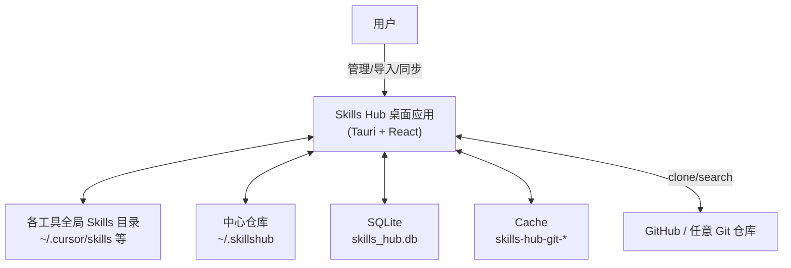
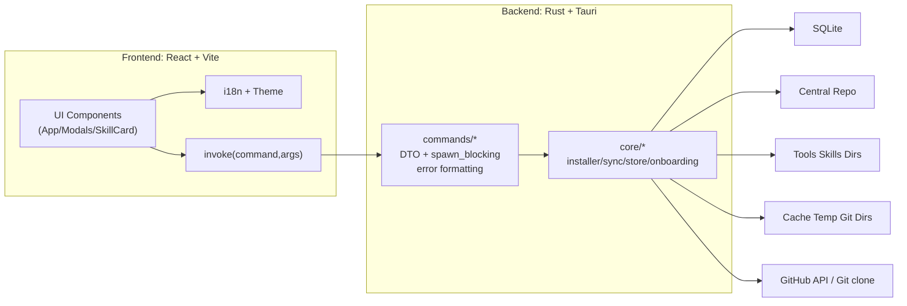
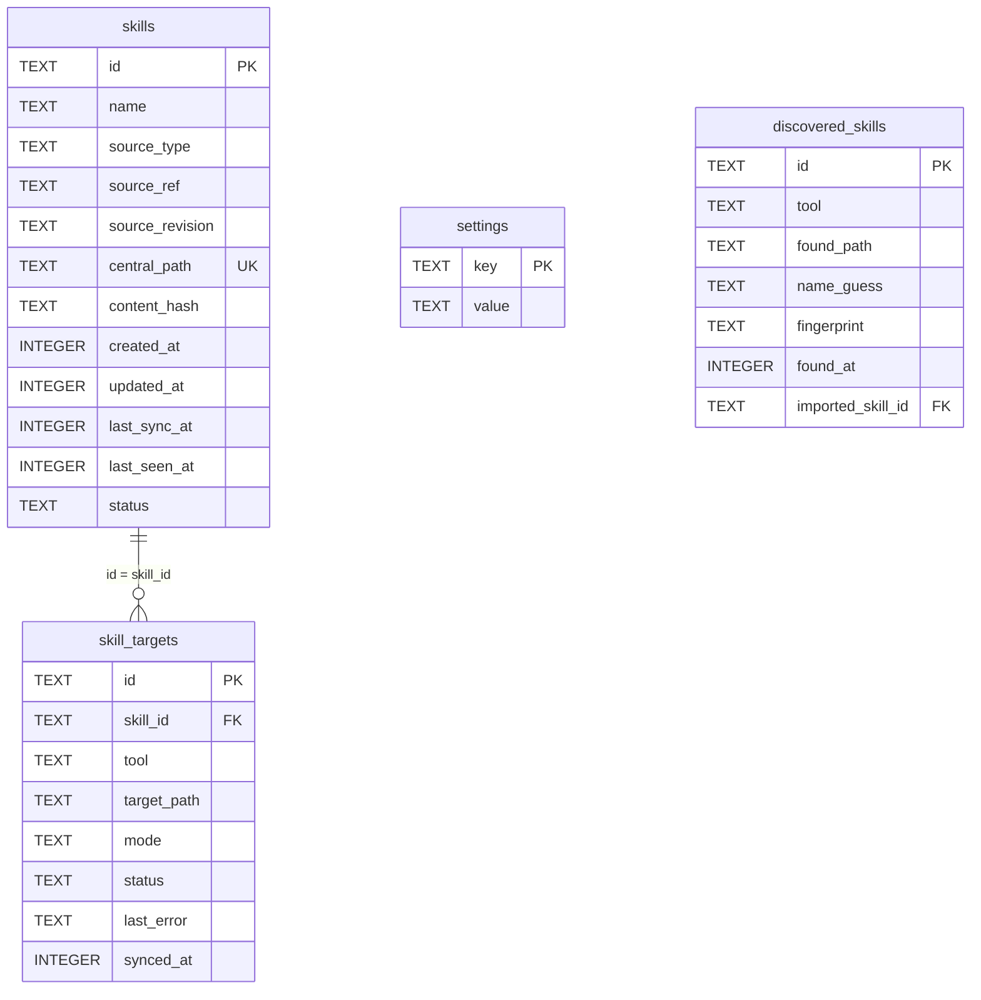
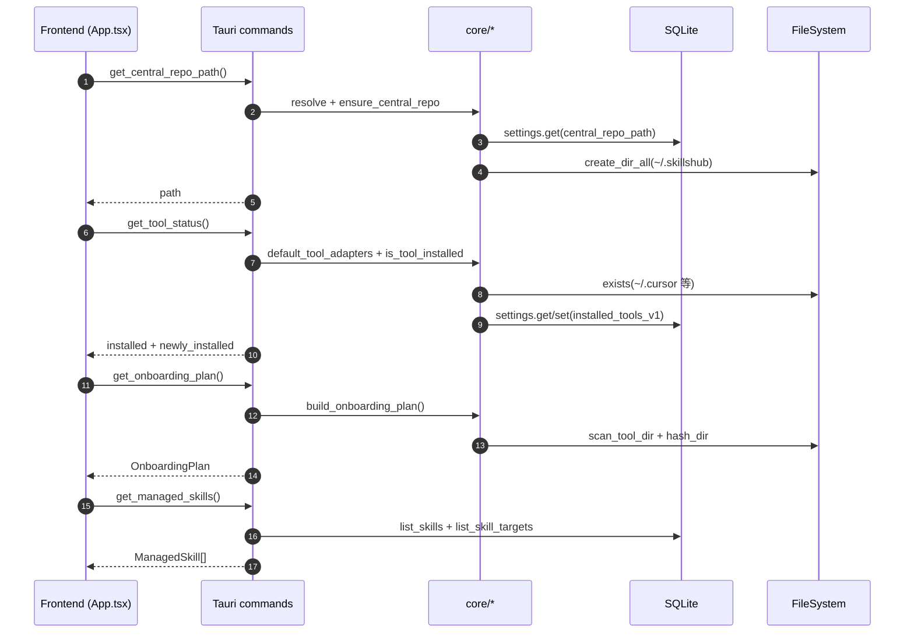
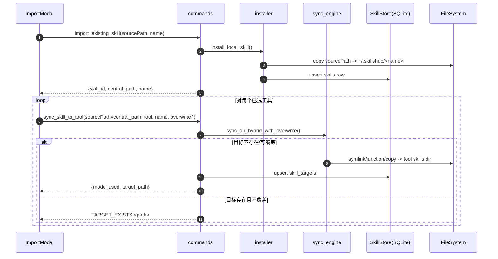
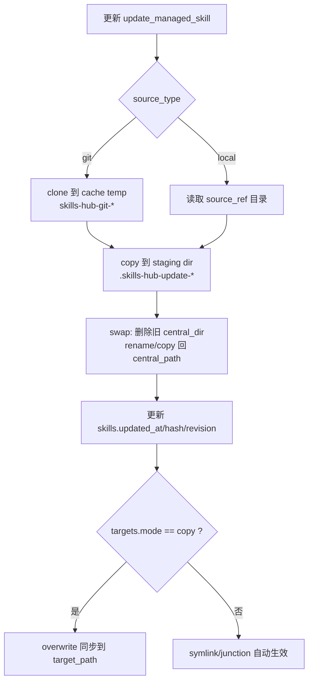

# Skills Hub（Tauri Desktop）系统设计文档

> English version: [`docs/system-design.md`](system-design.md)

> 基于当前仓库实现（commit `b5246ab`），结合历史计划与 UI 设计稿整理，目标是给后来维护者提供一份“能落地、可对照代码”的完整系统设计说明。  

## 1. 背景与问题定义

现代 AI 编程工具（如 Cursor、Claude Code、Codex 等）往往使用“Skills/Agents/Tools”机制扩展能力，但各工具的全局 skills 目录分散在用户主目录下不同位置，导致：

- **无法统一查看**：用户很难知道“我有哪些 Skill、在哪些工具生效、版本是否一致”。
- **重复安装与漂移**：同一个 Skill 被复制到多个工具目录，更新后不一致。
- **迁移成本高**：安装 Skills Hub 后，用户机器上可能已存在大量 skills，需要安全接管并去重。

Skills Hub 的核心思路是将 Skill 内容集中存放在“中心仓库（Central Repo）”，并把各工具目录中的技能以 **symlink/junction/copy** 的方式映射到中心仓库，实现 “Install once, sync everywhere”。

## 2. 目标与非目标

### 2.1 目标（当前实现覆盖）

- **统一视图**：列出 Hub 托管的 skills、其来源（local/git）以及对各工具的生效状态。
- **多工具同步**：对已安装工具，在其默认 skills 目录生成映射（优先链接，失败回退复制）。
- **迁移接管（Onboarding）**：扫描已安装工具目录中的已有 skills，按名称聚合并通过目录指纹检测冲突，提供导入与同步能力。
- **多来源导入**：
  - 本地目录导入（复制到中心仓库并入库）
  - Git 导入（支持 GitHub repo URL 与 folder URL；支持 multi-skill 仓库的候选选择）
  - GitHub 搜索（后端已实现，前端入口当前为 disabled）
- **更新**：按来源（git/local）重建中心目录；对 copy 模式的目标回灌更新。
- **工具动态检测**：启动时检测“新安装工具”，提示是否一键同步已托管 skills。
- **可配置中心仓库路径**：默认 `~/.skillshub`。

### 2.2 非目标（当前版本不做/不保证）

- 不做复杂的版本并存（例如 `name@cursor`）与多版本依赖解析。
- 不保证对“用户手工维护的外部 symlink 链接”做完整接管策略（仅在扫描中识别为 link 并展示）。
- 不提供云同步/多设备同步能力（当前为本机文件系统 + SQLite）。
- 不包含自动定时更新（设置文案有“24h auto-update”的占位，但当前未落地定时任务）。

## 3. 术语与核心概念

- **Skill**：一个以目录为单位的能力包，通常包含 `SKILL.md` 等文件。
- **Managed Skill**：被 Skills Hub 托管并持久化到 SQLite 的 Skill（中心目录为权威内容）。
- **Central Repo（中心仓库）**：Hub 存放 skills 内容的中心目录，默认 `~/.skillshub`（可配置）。
- **Tool/Agent**：一个支持 skills 的 AI 工具（cursor/claude_code/codex/...），每个工具有默认 skills 目录。
- **Target（同步目标）**：某个 managed skill 在某个工具目录里的映射结果（symlink/junction/copy），对应 DB 表 `skill_targets`。
- **Onboarding Plan**：首次/手动扫描得到的“候选导入集合”，按 skill name 聚合为 group，并在冲突时提供 variant 选择。
- **Fingerprint/Content Hash**：对 skill 目录计算的哈希（忽略 `.git` 等），用于判断不同工具里同名 skill 是否同内容。

## 4. 总体架构（C4 风格）

> 为了便于快速建立“脑内地图”，本章提供若干 Mermaid 架构/流程图。GitHub/多数 Markdown 预览器可直接渲染；若你的编辑器不支持，可用 Mermaid Preview 插件查看。

### 4.1 系统上下文（Context）

- 用户通过桌面应用管理本机 skills。
- 应用需要读写：
  - 用户主目录下各工具的默认 skills 目录（以及 detect 目录）
  - 中心仓库目录（默认 `~/.skillshub`）
  - 应用数据目录中的 SQLite DB（`skills_hub.db`）
  - 应用缓存目录中的 git 临时 clone 目录（`skills-hub-git-*`）

### 4.2 容器（Containers）

- **Frontend（WebView）**：React + Vite，负责 UI/交互、i18n、主题切换、调用 Tauri commands。
- **Backend（Tauri Rust）**：提供文件系统操作、Git 拉取、SQLite 持久化、工具适配与扫描、同步引擎等能力。
- **SQLite（嵌入式）**：`rusqlite`（bundled）存储托管技能与同步状态等。

### 4.3 组件（Components）

前端（`src/`）：

- `src/main.tsx`：入口，初始化 i18n，渲染 `App`。
- `src/App.tsx`：单页 Dashboard，聚合状态与业务流程（扫描/导入/同步/更新/删除/设置）。
- `src/components/skills/*`：Header、FilterBar、SkillCard、SkillsList、各类 Modal。
- `src/i18n/*`：i18next 资源与初始化。
- `src/index.css`、`src/App.css`：设计稿风格的 token + 组件样式（支持 light/dark）。

后端（`src-tauri/src/`）：

- `src-tauri/src/lib.rs`：Tauri Builder，初始化 DB、注册 commands、启动临时目录清理任务。
- `src-tauri/src/commands/mod.rs`：Tauri commands 对外接口层（线程隔离、错误格式化、DTO）。
- `src-tauri/src/core/*`：核心业务模块（见 6 章）。

## 5. 数据与存储设计

### 5.1 文件系统布局

#### 中心仓库

- 默认路径：`~/.skillshub`（`src-tauri/src/core/central_repo.rs`）
- 每个 Skill 使用一个目录：`<central_repo>/<skill_name>/`
- 特性：
  - **不存完整 git repo**：git 导入使用临时 clone，再把内容复制进中心目录，避免中心目录包含 `.git`。
  - **名称即目录名**：默认取来源目录名 / repo 名 / subpath 末段；允许用户在导入时指定 display name。

#### Git 临时目录（缓存）

- 位置：Tauri `app_cache_dir()`（OS 特定）
- 命名：`skills-hub-git-<uuid>`
- 安全标记：写入 marker 文件 `.skills-hub-git-temp`
- 清理策略：应用启动后台 best-effort 清理超过 24h 的目录（仅匹配 prefix + marker）

#### 工具目录

每个 tool adapter 提供：

- `relative_skills_dir`：全局 skills 目录（相对 home）
- `relative_detect_dir`：用于判断工具是否“已安装”的目录（相对 home）

例如 Cursor：

- detect：`~/.cursor`
- skills：`~/.cursor/skills`

当前支持的 AI 编程工具（Tool Adapters，见 `src-tauri/src/core/tool_adapters/mod.rs`）如下：

| tool key | 显示名称 | skills 目录（相对 `~`） | detect 目录（相对 `~`） |
| --- | --- | --- | --- |
| `cursor` | Cursor | `.cursor/skills` | `.cursor` |
| `claude_code` | Claude Code | `.claude/skills` | `.claude` |
| `codex` | Codex | `.codex/skills` | `.codex` |
| `opencode` | OpenCode | `.config/opencode/skills` | `.config/opencode` |
| `antigravity` | Antigravity | `.gemini/antigravity/global_skills` | `.gemini/antigravity` |
| `amp` | Amp | `.config/agents/skills` | `.config/agents` |
| `kimi_cli` | Kimi Code CLI | `.config/agents/skills` | `.config/agents` |
| `augment` | Augment | `.augment/rules` | `.augment` |
| `openclaw` | OpenClaw | `.moltbot/skills` | `.moltbot` |
| `cline` | Cline | `.cline/skills` | `.cline` |
| `codebuddy` | CodeBuddy | `.codebuddy/skills` | `.codebuddy` |
| `command_code` | Command Code | `.commandcode/skills` | `.commandcode` |
| `continue` | Continue | `.continue/skills` | `.continue` |
| `crush` | Crush | `.config/crush/skills` | `.config/crush` |
| `junie` | Junie | `.junie/skills` | `.junie` |
| `iflow_cli` | iFlow CLI | `.iflow/skills` | `.iflow` |
| `kiro_cli` | Kiro CLI | `.kiro/skills` | `.kiro` |
| `kode` | Kode | `.kode/skills` | `.kode` |
| `mcpjam` | MCPJam | `.mcpjam/skills` | `.mcpjam` |
| `mistral_vibe` | Mistral Vibe | `.vibe/skills` | `.vibe` |
| `mux` | Mux | `.mux/skills` | `.mux` |
| `openclaude` | OpenClaude IDE | `.openclaude/skills` | `.openclaude` |
| `openhands` | OpenHands | `.openhands/skills` | `.openhands` |
| `pi` | Pi | `.pi/agent/skills` | `.pi` |
| `qoder` | Qoder | `.qoder/skills` | `.qoder` |
| `qwen_code` | Qwen Code | `.qwen/skills` | `.qwen` |
| `trae` | Trae | `.trae/skills` | `.trae` |
| `trae_cn` | Trae CN | `.trae-cn/skills` | `.trae-cn` |
| `zencoder` | Zencoder | `.zencoder/skills` | `.zencoder` |
| `neovate` | Neovate | `.neovate/skills` | `.neovate` |
| `pochi` | Pochi | `.pochi/skills` | `.pochi` |
| `adal` | AdaL | `.adal/skills` | `.adal` |
| `kilo_code` | Kilo Code | `.kilocode/skills` | `.kilocode` |
| `roo_code` | Roo Code | `.roo/skills` | `.roo` |
| `goose` | Goose | `.config/goose/skills` | `.config/goose` |
| `gemini_cli` | Gemini CLI | `.gemini/skills` | `.gemini` |
| `github_copilot` | GitHub Copilot | `.copilot/skills` | `.copilot` |
| `clawdbot` | Clawdbot | `.clawdbot/skills` | `.clawdbot` |
| `droid` | Droid | `.factory/skills` | `.factory` |
| `windsurf` | Windsurf | `.codeium/windsurf/skills` | `.codeium/windsurf` |

备注：
- 工具“是否安装”的判断规则：detect 目录存在即认为已安装（`is_tool_installed`）。
- 扫描 Codex 的 skills 时会过滤目录名 `.system`（避免把系统内置技能当作可迁移对象）。

### 5.2 SQLite 数据模型

DB 文件路径：`app_data_dir()/skills_hub.db`（`src-tauri/src/core/skill_store.rs`）

#### 表：`skills`

代表 Hub 托管的技能（中心仓库权威）。

- `id`：UUID
  - `name`：展示名称（也用于中心目录名）
  - `source_type`：`local` | `git`
  - `source_ref`：本地路径或 URL
  - `source_revision`：git commit（若可得）
  - `central_path`：中心目录路径（unique）
  - `content_hash`：目录 fingerprint（可为空）
  - `created_at` / `updated_at` / `last_sync_at` / `last_seen_at`
  - `status`：目前主要使用 `ok`

#### 表：`skill_targets`

每条记录代表一个 skill 在某个工具中的生效映射。

- `skill_id` + `tool` 唯一
- `target_path`：工具目录中的路径（最终路径）
- `mode`：`auto` | `symlink` | `junction` | `copy`
- `status` / `last_error` / `synced_at`

#### 表：`settings`

key/value 存储：

- `central_repo_path`：中心仓库路径（可选）
- `installed_tools_v1`：最近一次检测到的已安装工具 key 列表（JSON）
- `onboarding_completed`：当前实现提供 set/get 接口，但 Onboarding 是否完成逻辑尚未作为 gating 条件使用（可作为后续增强点）

#### 表：`discovered_skills`

当前 schema 存在，但前端/后端主流程使用的是“运行时扫描生成 plan”，并未将扫描结果落库（预留后续增强）。

## 6. 后端核心模块设计（Rust）

> 代码集中在 `src-tauri/src/core/*`，commands 仅做线程隔离/DTO/错误格式化。

### 6.1 Tool Adapters（工具适配层）

文件：`src-tauri/src/core/tool_adapters/mod.rs`

职责：

- 定义 `ToolId` 与 `ToolAdapter`（display name、skills 路径、detect 路径）。
- `is_tool_installed()`：通过 detect 目录存在性判断。
- `scan_tool_dir()`：遍历 skills 目录下的一级子目录作为 skill 名；Codex 额外过滤 `.system`。
- `detect_link()`：用 `symlink_metadata/read_link` 尝试识别链接，并返回 `is_link/link_target`（用于 Onboarding 展示）。

### 6.2 Onboarding（扫描与聚合）

文件：`src-tauri/src/core/onboarding.rs`

流程：

1. 遍历所有 adapters，跳过未安装工具。
2. 扫描 tools 的 skills 目录得到 `DetectedSkill` 列表。
3. 对每个 detected skill 计算 `fingerprint = hash_dir(path)`（忽略 `.git` 等）。
4. 按 `skill.name` 聚合为 group：
   - `has_conflict`：同组内 fingerprint 去重后数量 > 1（无 fingerprint 时按 1 处理）。

输出：`OnboardingPlan`（`total_tools_scanned/total_skills_found/groups`）。

### 6.3 Content Hash（目录指纹）

文件：`src-tauri/src/core/content_hash.rs`

实现要点：

- WalkDir 遍历目录（不 follow links）。
- 忽略：`.git`、`.DS_Store`、`Thumbs.db`、`.gitignore`（按名称）。
- 哈希包含相对路径 + 文件内容。

### 6.4 Sync Engine（混合同步）

文件：`src-tauri/src/core/sync_engine.rs`

核心策略：

- 目标不存在：
  1) 尝试 symlink（Unix；Windows 尝试 symlink_dir）
  2) Windows 额外尝试 junction（需要 `junction` crate）
  3) 最后回退 copy（递归复制）
- 目标已存在：
  - 若目标是指向 source 的同一个链接：视为已同步（幂等）。
  - 否则：
    - `overwrite=false`：报错 `target already exists`
    - `overwrite=true`：先删除目标目录，再按正常流程同步

设计取舍：

- 将“是否覆盖”作为显式参数，默认不覆盖，避免破坏用户既有目录。
- 通过 “先 staging、后 swap” 的更新策略，降低更新时半成品状态风险（见 installer 的 update）。

### 6.5 Installer（导入/更新）

文件：`src-tauri/src/core/installer.rs`

#### 本地导入（`install_local_skill`）

- 将 source 目录递归复制到 `central_repo/<name>`。
- 生成 `SkillRecord` 入库（`source_type=local`，`source_ref=source_path`）。
- 若中心目录已存在：报错 `skill already exists in central repo`（前端会映射为友好提示）。

#### Git 导入（`install_git_skill`）

- 解析 GitHub URL（支持 repo root、`.git`、`/tree/<branch>/<path>`、`/blob/<branch>/<path>`）。
- clone 到缓存临时目录（优先系统 `git` CLI，失败回退 libgit2），标记 `.skills-hub-git-temp`。
- 复制目标目录到中心仓库：
  - folder URL：复制 subpath
  - repo root URL：若检测到 `skills/` 下存在 >=2 个 `SKILL.md`，抛出 `MULTI_SKILLS|...` 引导用户改用 folder URL 或走候选选择流程
- 删除临时目录（best-effort）
- 入库 `source_type=git`、`source_ref=原始 URL`、`source_revision=HEAD`

#### Multi-skill 仓库候选（`list_git_skills` / `install_git_skill_from_selection`）

- `list_git_skills`：
  - root-level `SKILL.md` -> candidate `"."`
  - 扫描 `skills/*`、`skills/.curated/*`、`skills/.experimental/*`、`skills/.system/*`
  - 解析 `SKILL.md` 的 YAML front matter 获取 `name/description`（若存在）
- `install_git_skill_from_selection`：
  - clone -> copy -> 入库（类似 git 导入）
  - display name 默认取 subpath 末段或 repo 名

#### 更新（`update_managed_skill_from_source`）

- 根据 `skills.source_type` 重新构建新内容到 sibling staging dir：`.skills-hub-update-<uuid>`
- swap：删除旧中心目录 -> rename staging（跨盘 rename 失败则 copy fallback）
- 更新 `skills.updated_at/content_hash/source_revision` 等
- 若 `skill_targets.mode == "copy"`：对这些 target 执行 overwrite 同步，让工具目录内容跟随更新（symlink/junction 自动生效无需处理）

### 6.6 Git Fetcher（拉取策略）

文件：`src-tauri/src/core/git_fetcher.rs`

策略：

- 优先使用系统 `git` CLI（更符合用户本机网络/代理/证书/Keychain 配置）。
- CLI 失败再回退 libgit2（保持在无 git 环境仍可用）。

### 6.7 GitHub Search（仓库搜索）

文件：`src-tauri/src/core/github_search.rs`

- 调用 GitHub Search API：`https://api.github.com/search/repositories`
- `reqwest::blocking`，设置 `User-Agent: skills-hub`
- 返回 `RepoSummary`（full_name/html_url/description/stars/updated_at/clone_url）
- 备注：当前前端搜索 tab 为 disabled；可作为后续启用点。

### 6.8 Temp Cleanup（临时目录清理）

文件：`src-tauri/src/core/temp_cleanup.rs`

- 仅清理满足三重条件的目录：
  1) 位于 app_cache_dir
  2) 名称前缀 `skills-hub-git-`
  3) 含 marker 文件 `.skills-hub-git-temp`
- 并要求目录 `modified` 时间超过 max_age（目前 24h）。

## 7. Commands（前后端接口契约）

文件：`src-tauri/src/commands/mod.rs`

### 7.1 调用方式

前端通过 `@tauri-apps/api/core` 的 `invoke(command, args)` 调用；耗时操作统一在后端 `spawn_blocking`。

### 7.2 主要 commands 列表

- `get_central_repo_path() -> string`
- `set_central_repo_path(path: string) -> string`
- `get_tool_status() -> { tools[], installed[], newly_installed[] }`
- `get_onboarding_plan() -> OnboardingPlan`
- `get_managed_skills() -> ManagedSkill[]`
- `install_local(sourcePath: string, name?: string) -> InstallResultDto`
- `install_git(repoUrl: string, name?: string) -> InstallResultDto`
- `list_git_skills_cmd(repoUrl: string) -> GitSkillCandidate[]`
- `install_git_selection(repoUrl: string, subpath: string, name?: string) -> InstallResultDto`
- `import_existing_skill(sourcePath: string, name?: string) -> InstallResultDto`（当前与 `install_local` 等价）
- `sync_skill_dir(source_path: string, target_path: string) -> { mode_used, target_path }`（底层工具）
- `sync_skill_to_tool(sourcePath: string, skillId: string, tool: string, name: string, overwrite?: boolean) -> { mode_used, target_path }`
- `unsync_skill_from_tool(skillId: string, tool: string) -> void`
- `update_managed_skill(skillId: string) -> { skill_id, name, content_hash?, source_revision?, updated_targets[] }`
- `delete_managed_skill(skillId: string) -> void`
- `search_github(query: string, limit?: number) -> RepoSummary[]`

### 7.3 错误契约与前端分流

后端对 `anyhow::Error` 进行格式化，并保留以下前缀供前端识别：

- `MULTI_SKILLS|...`：仓库包含多个 skill，需要走候选选择或提供 folder URL。
- `TARGET_EXISTS|<path>`：目标目录存在且未覆盖，前端提示用户清理/取消勾选。
- `TOOL_NOT_INSTALLED|<tool>`：工具未安装。

此外对 GitHub clone 失败做了启发式中文提示（TLS/鉴权/DNS/超时等）。

## 8. 前端 UI 与交互设计

### 8.1 页面结构（当前为单页 Dashboard）

文件：`src/App.tsx` + `src/components/skills/*`

主要区域：

- Header：品牌、语言切换、设置、添加 Skill
- FilterBar：排序（updated/name）、搜索、刷新
- Discovered Banner：扫描到可导入 skills 时显示 “Review & Import”
- Skills List：卡片列表（每个 skill 显示来源、更新时间、工具 pills、更新/删除按钮）
- Modals：
  - AddSkillModal（local/git 两个 tab；选择 sync targets）
  - ImportModal（Onboarding plan 的 group/variant 选择与导入）
  - GitPickModal（multi-skill 仓库候选选择）
  - SettingsModal（语言、主题、中心仓库路径）
  - DeleteModal（删除确认）
  - NewToolsModal（新安装工具提示是否 sync all）
  - LoadingOverlay（耗时操作遮罩与提示）

### 8.2 i18n 与主题

- i18n：`react-i18next`，资源在 `src/i18n/resources.ts`，默认 `en`，可切换 `zh`。
- 主题：`src/index.css` 定义 CSS variables，`src/App.tsx` 使用 localStorage 保存 `skills-theme`（system/light/dark），并同步 `documentElement.dataset.theme`。

### 8.3 核心用户路径（前端侧）

#### 启动加载

1. 若运行在 Tauri 环境：
   - 拉取 `get_central_repo_path`（展示在设置）
   - 拉取 `get_tool_status`（工具安装状态 + newly installed 检测）
   - 拉取 `get_onboarding_plan`（用于 discovered banner）
   - 拉取 `get_managed_skills`（托管列表）

#### 导入已发现 Skills（Review & Import）

1. 打开 ImportModal（若 plan 为空先调用 `get_onboarding_plan`）
2. 按 group 勾选要导入的技能
3. 若 `has_conflict`，必须在 variants 中选择一个来源路径
4. 执行导入：
   - 对每个选中 group：调用 `import_existing_skill(sourcePath=<chosen variant path>, name=<group name>)`
   - 再对“已安装且勾选的工具”逐个调用 `sync_skill_to_tool`
   - `overwrite` 策略：若同步回“来源工具”则 `overwrite=true`（接管）；否则默认不覆盖

#### 添加 Skill（Local/Git）

- local：先 `list_local_skills_cmd` 扫描目录（规则与 Git 一致），
  - 多个候选则弹出选择列表（无效候选置灰并标注原因）
  - 单个有效候选则 `install_local_selection` -> 对选中工具逐个 `sync_skill_to_tool`
- git：
  - folder URL：直接 `install_git` -> 同步
  - repo root URL：`list_git_skills_cmd` -> GitPickModal 选择 -> `install_git_selection` -> 同步

#### 切换工具生效（Tool Pills）

- 未生效 -> 生效：`sync_skill_to_tool(sourcePath=central_path, ...)`
- 已生效 -> 取消：`unsync_skill_from_tool(skillId, tool)`

#### 更新 & 删除

- 更新：`update_managed_skill(skillId)`（后端会对 copy targets 回灌更新）
- 删除：`delete_managed_skill(skillId)`（先清理工具目录映射，再删除中心目录与 DB）

## 9. 关键一致性与安全策略

### 9.1 “默认不破坏用户环境”

- 同步默认 `overwrite=false`，目标存在即失败并给出 `TARGET_EXISTS|...`。
- 仅在明确需要“接管”的场景，前端才传 `overwrite=true`（当前：导入 discovered skill 且同步回来源工具）。

### 9.2 删除与清理的边界

- `delete_managed_skill` 仅清理 DB 中记录过的 `skill_targets.target_path`，不会全盘扫描/删除工具目录。
- Git 临时目录清理限定 prefix + marker + age gate，降低误删风险。

### 9.3 权限与跨平台差异

- Windows 上 symlink 可能受权限/策略限制：引擎会尝试 junction，最后回退 copy。
- 复制模式的 targets 需要在更新时显式回灌，否则工具目录可能滞后；后端已实现该传播逻辑。

## 10. 性能与稳定性

- 后端耗时操作使用 `spawn_blocking`，避免阻塞 UI。
- 前端 LoadingOverlay 在长操作期间提供提示（clone/IO 10–60s）。
- Git 拉取优先系统 git，提高 macOS 网络/证书兼容性。
- 错误信息：
  - 尽量包含 root cause
  - 对 clone “临时目录路径”做脱敏（减少噪音）
  - 对 GitHub/TLS/鉴权等提供可行动提示

## 11. 测试与验证建议（仓库当前缺少自动化测试时的落地方案）

> 当前仓库未显式提供 Rust/前端测试用例。建议按模块逐步补齐：

- Rust（core）：
  - `content_hash`：忽略文件名/顺序稳定性
  - `parse_github_url`：覆盖 repo/tree/blob/.git 组合
  - `sync_engine`：用临时目录验证 overwrite/幂等行为（平台差异可通过条件编译分组）
- 前端：
  - `App` 的业务逻辑建议逐步下沉到 hooks（便于单测）
  - Modal 表单校验与错误映射（`TARGET_EXISTS|` 等）

## 12. 现状梳理与后续路线图（建议）

### 12.1 已完成（与实现一致）

- 多工具 adapter 支持与安装检测
- Onboarding 扫描（冲突检测 + link 展示）
- local/git 导入与 multi-skill 候选选择
- 混合同步（symlink/junction/copy）
- 更新（copy targets 回灌）
- 新安装工具提示
- 中心仓库路径设置与迁移

### 12.2 后续增强方向（按价值/风险）

1. **启用 GitHub 搜索 UI**：对接 `search_github`，并支持一键安装候选仓库。
2. **扫描结果落库**：使用 `discovered_skills` 表持久化“发现但未导入”的技能，支持忽略/标记与增量刷新。
3. **Onboarding gating**：引入 `settings.onboarding_completed`，仅在首次启动/用户触发时弹出导入引导，避免每次都显示 discovered banner。
4. **更强冲突策略**：支持 `name@variant` 的版本并存（需要 UI 显式展示与命名规范）。
5. **维护任务**：提供“清理失效 targets / 修复 broken link / 重新同步所有 copy targets”入口。
